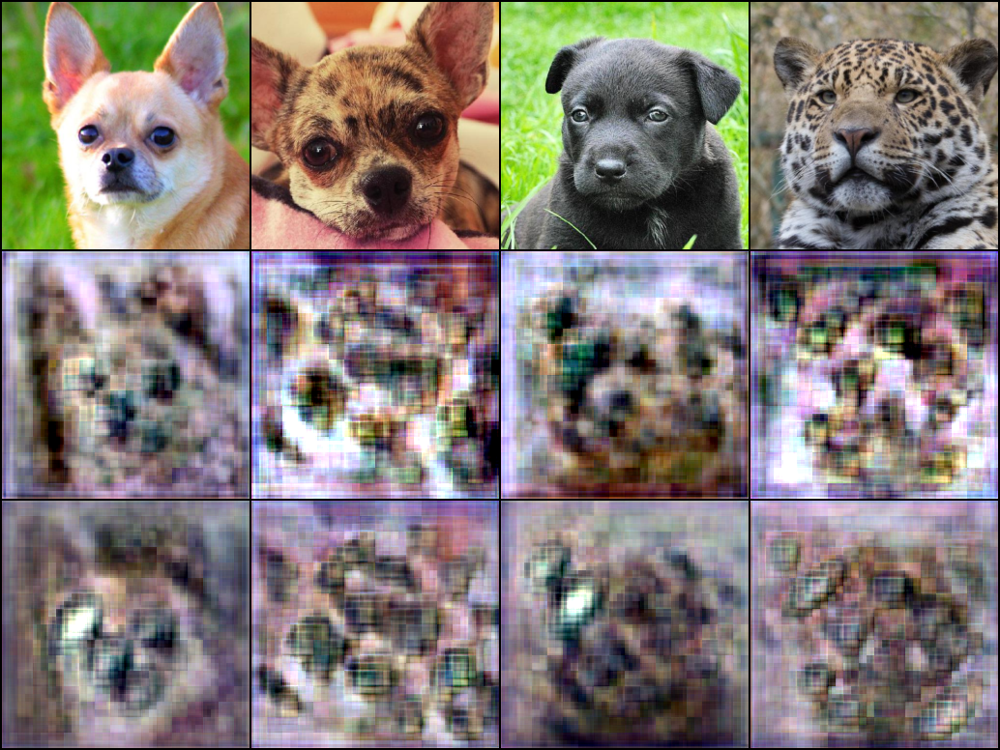
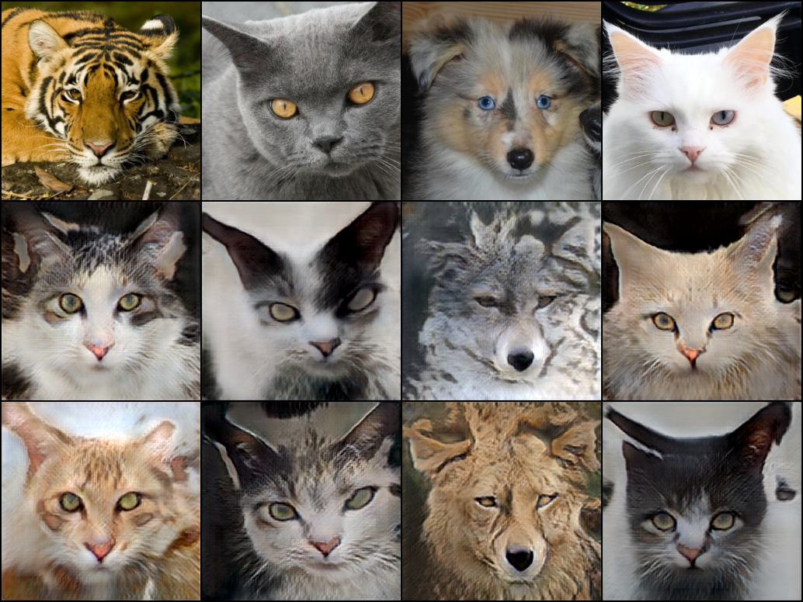
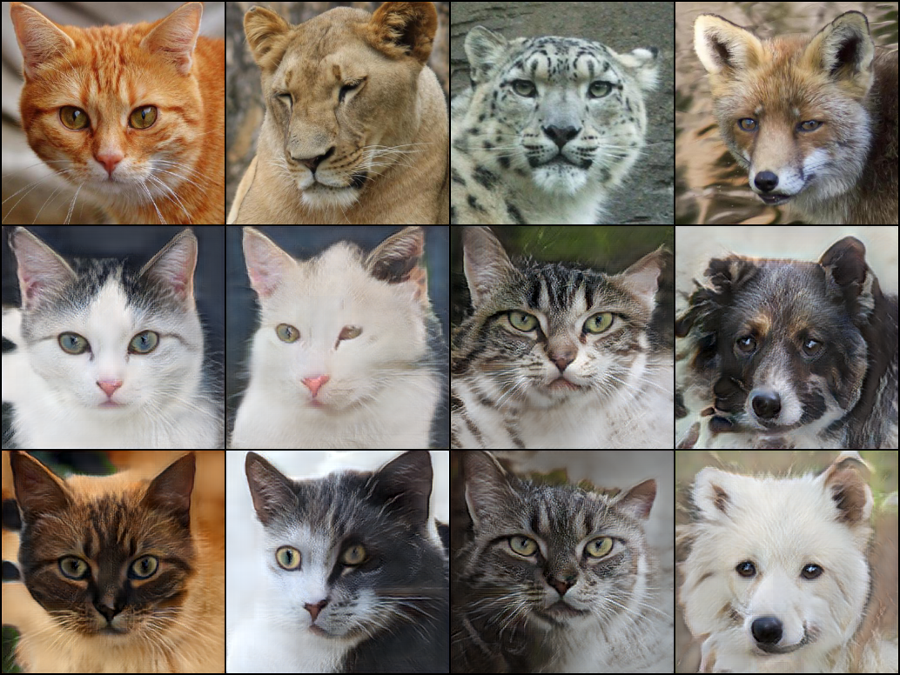
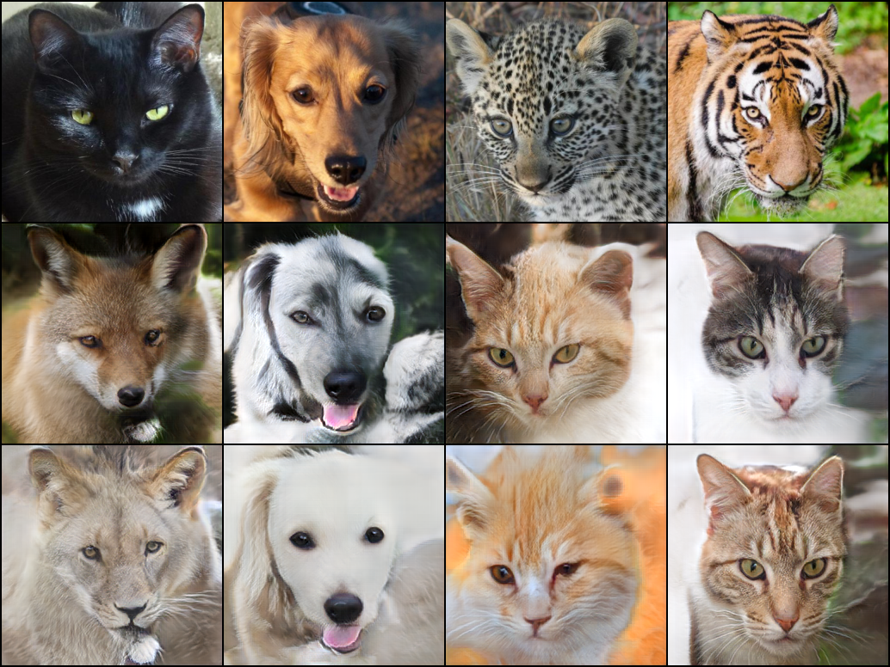

# StarGAN v2 — AFHQ 이미지 변환 실험

[English](README.md) | 한국어

[StarGAN v2: Diverse Image Synthesis for Multiple Domains](https://arxiv.org/abs/1912.01865)의 구조를 바탕으로, AFHQ 동물 얼굴 이미지의 도메인 간 변환을 학습하고 평가하는 PyTorch 연구 프로젝트이다. 고양이(`cat`), 개(`dog`), 야생동물(`wild`)의 세 도메인을 사용한다.

프로젝트 루트에는 자체 모델·학습·평가 스크립트가 있고, `stargan-v2/`에는 [공식 PyTorch 구현](https://github.com/clovaai/stargan-v2)이 포함되어 있다. 두 구현은 실행 방법과 체크포인트 형식이 다르므로 아래 안내에 따라 사용한다.

## 프로젝트 구조

```text
StarGAN_v2/
├── README.md                  # 영문 기본 문서
├── README_kr.md               # 국문 문서
├── model.py                   # train.py에서 사용하는 자체 모델
├── model_fixed.py             # 별도 모델 구조; test.py에서 자동 판별하여 사용
├── train.py                   # 잠재 벡터 기반 학습, 샘플·체크포인트 저장
├── test.py                    # 체크포인트 평가, 변환 이미지 저장
├── download_data.py           # 공식 다운로드 스크립트를 통한 AFHQ 준비
├── 1912.01865v2.pdf            # StarGAN v2 논문
├── checkpoints/
│   └── 20000_nets.ckpt         # 현재 포함된 실험 체크포인트
├── samples/                   # 학습 중 입력·변환 이미지 그리드
├── eval_results/
│   └── metrics.json            # 저장된 평가 결과
└── stargan-v2/
    ├── README.md              # 공식 구현의 상세 사용법
    ├── LICENSE                # 공식 코드의 라이선스
    ├── main.py                # 공식 학습·샘플 생성·평가 진입점
    ├── download.sh
    ├── core/
    ├── metrics/
    │   └── lpips_weights.ckpt
    ├── assets/
    └── data/afhq/
        ├── train/{cat,dog,wild}/
        └── val/{cat,dog,wild}/
```

## 모델과 학습 목적

| 구성 요소 | 역할 |
| --- | --- |
| Generator (`G`) | 입력 이미지와 스타일 코드를 받아 변환 이미지 생성 |
| Mapping Network (`F`) | 잠재 벡터 `z`와 목표 도메인으로 스타일 코드 생성 |
| Style Encoder (`E`) | 이미지에서 도메인별 스타일 코드 추출 |
| Discriminator (`D`) | 각 도메인에 대한 이미지의 진위 점수 계산 |

`train.py`는 다음 손실을 조합하여 학습한다.

```text
L_G = L_adv + lambda_sty * L_sty
            - lambda_ds * L_ds + lambda_cyc * L_cyc
```

- **Adversarial loss**: 목표 도메인의 실제 이미지처럼 보이도록 학습한다.
- **Style reconstruction loss**: 생성 이미지에서 추출한 스타일이 목표 스타일과 일치하도록 한다.
- **Style diversification loss**: 같은 입력에 서로 다른 스타일을 적용했을 때 다양한 출력을 유도한다.
- **Cycle consistency loss**: 변환 이미지를 원래 스타일로 되돌렸을 때 입력을 복원하도록 한다.

현재 루트 학습 스크립트에는 공식 구현의 R1 정규화, EMA 갱신, 참조 이미지 기반 추가 업데이트, 다양성 손실 가중치 감소가 구현되어 있지 않다. 논문의 전체 학습 절차는 `stargan-v2/`의 공식 구현을 참고한다.

## 실험 환경

이 프로젝트에 저장된 실험은 **MacBook Pro의 Apple M4 Pro, RAM 24GB 환경에서 PyTorch MPS 장치로 실행**했다.

| 항목 | 실험 환경 |
| --- | --- |
| 컴퓨터 | MacBook Pro |
| 칩 | Apple M4 Pro |
| 메모리 | 24GB RAM |
| 운영체제 | macOS |
| 연산 백엔드 | PyTorch MPS |
| PyTorch 장치 | `mps` |
| 평가 체크포인트 | `checkpoints/20000_nets.ckpt` |
| 평가 데이터 | AFHQ `val` — cat, dog, wild |

하드웨어와 MPS 사용 정보는 실험자가 제공한 환경이다. macOS·Python·PyTorch의 세부 버전과 학습 시간은 별도 기록이 없다. 아래 학습 설정 표는 현재 `train.py`의 기본값이며, 저장된 체크포인트의 전체 실험 설정을 복원한 값은 아니다.

## 환경 설치

아래 명령은 프로젝트 루트에서 실행한다. macOS/Linux 기준이며, 데이터 다운로드에는 `git`, `bash`, `wget`, `unzip`이 필요하다. Windows에서는 WSL 등 Bash를 사용할 수 있는 환경이 필요하다.

Python 3.10 이상의 가상환경을 기준으로 시작할 수 있다. PyTorch 설치는 운영체제와 GPU 환경에 맞는 [공식 설치 안내](https://pytorch.org/get-started/locally/)를 따른다. 현재 루트에는 의존성 버전을 고정한 파일이 없으므로 아래 예시는 설치 출발점이며, 검증된 버전 조합을 보장하지 않는다.

```bash
cd /Users/jongbinkim/Documents/Research/PP/StarGAN_v2
python3 -m venv .venv
source .venv/bin/activate
python -m pip install --upgrade pip

# macOS 기본 설치 예시
python -m pip install torch torchvision numpy pillow
```

CUDA 환경에서는 위의 `torch torchvision` 설치 부분을 공식 안내의 CUDA용 명령으로 대체하고, `numpy pillow`도 설치한다.

설치 후 장치 사용 가능 여부를 확인한다.

```bash
python -c "import torch; print('PyTorch:', torch.__version__); print('MPS:', torch.backends.mps.is_available()); print('CUDA:', torch.cuda.is_available())"
```

루트의 `train.py`와 `test.py --device auto`는 **MPS → CUDA → CPU** 순서로 장치를 선택한다. `test.py`는 `--device cpu`, `--device mps`, `--device cuda`로 장치를 지정할 수도 있다.

## AFHQ 데이터 준비

이미 `stargan-v2/data/afhq/train`과 `val`에 이미지가 있다면 다운로드를 생략한다. 새로 준비할 때는 다음 명령을 실행한다.

```bash
python download_data.py
```

이 스크립트는 `stargan-v2/`가 없으면 공식 저장소를 복제하고, 해당 폴더에서 `bash download.sh afhq-dataset`을 실행한다. 압축 해제 후 구조는 다음과 같아야 한다.

```text
stargan-v2/data/afhq/
├── train/
│   ├── cat/
│   ├── dog/
│   └── wild/
└── val/
    ├── cat/
    ├── dog/
    └── wild/
```

`torchvision.datasets.ImageFolder`가 폴더명을 정렬하여 라벨을 부여하므로, 위 구조에서는 `cat=0`, `dog=1`, `wild=2`이다. 코드에서 야생동물을 설명할 때 사용하는 “Wildlife”와 실제 폴더명 `wild`를 구분한다.

현재 포함된 데이터는 다음과 같다.

| 도메인 | 학습 이미지 | 검증 이미지 |
| --- | ---: | ---: |
| cat | 5,153 | 500 |
| dog | 4,739 | 500 |
| wild | 4,738 | 500 |
| 합계 | 14,630 | 1,500 |

학습 전처리는 `256 × 256` 크기 변경, 무작위 수평 반전, 텐서 변환, `[-1, 1]` 정규화이다. 평가에서는 수평 반전을 사용하지 않는다.

## 자체 구현 학습

```bash
python train.py
```

학습 설정은 `train.py` 상단의 `CONFIG`에서 직접 수정한다. 이 스크립트에는 명령행 인자 파서가 없다.

| 설정 | 기본값 | 의미 |
| --- | --- | --- |
| `img_size` | `256` | 입력 이미지 크기 |
| `batch_size` | `4` | 학습 배치 크기 |
| `num_domains` | `3` | 도메인 수 |
| `latent_dim` / `style_dim` | `16` / `64` | 잠재 벡터·스타일 코드 차원 |
| `total_iters` | `200000` | 전체 학습 반복 수 |
| `lr_G` / `lr_D` / `lr_E` | `1e-4` | G·D·E 학습률 |
| `lr_F` | `1e-6` | Mapping Network 학습률 |
| `beta1` / `beta2` | `0.0` / `0.99` | Adam 계수 |
| `lambda_sty` / `lambda_ds` / `lambda_cyc` | `1.0` / `2.0` / `1.0` | 손실 가중치 |
| `dataset_path` | `./stargan-v2/data/afhq/train` | 학습 데이터 위치 |
| `sample_every` / `save_every` | `1000` / `10000` | 샘플·체크포인트 저장 간격 |
| `sample_dir` / `checkpoint_dir` | `samples` / `checkpoints` | 결과 저장 위치 |

100회마다 손실이 출력되고, 설정된 간격마다 다음 파일이 저장된다.

```text
samples/<iteration>.png                # 입력 이미지와 변환 이미지 그리드
checkpoints/<iteration>_nets.ckpt       # G, F, E, D의 state_dict
```

**학습 재개 제한:** 현재 `resume_iter`는 반복문의 시작 번호만 바꾸며, 체크포인트를 불러오지 않는다. `train.py`가 저장하는 파일에는 옵티마이저 상태와 EMA 가중치도 없다. `resume_iter` 값만 바꾸어 기존 학습을 이어갈 수는 없다.

**모델 선택:** `train.py`는 `model.py`를 사용한다. `model_fixed.py`가 존재해도 학습 모델이 자동으로 바뀌지 않는다. 현재 포함된 `20000_nets.ckpt`에는 `model_fixed.py` 구조의 가중치, EMA 가중치와 옵티마이저 상태가 들어 있어 현재 `train.py`의 저장 형식과 다르다. 평가 스크립트는 이 구조를 판별하지만, 학습 스크립트에는 해당 체크포인트를 복원하는 기능이 없다.

## 체크포인트 평가와 이미지 생성

현재 포함된 체크포인트를 평가하려면 다음 명령을 사용한다.

```bash
python test.py --step 20000 --device mps
```

체크포인트 선택 인자를 생략하면 `checkpoints/`에서 `<숫자>_nets.ckpt` 형식의 파일 중 반복 번호가 가장 큰 파일을 선택한다.

```bash
python test.py
```

체크포인트, 데이터 위치, 저장 폴더를 직접 지정하고 변환 이미지를 저장하는 예시이다.

```bash
python test.py \
  --checkpoint checkpoints/20000_nets.ckpt \
  --data_dir stargan-v2/data/afhq/val \
  --device mps \
  --output_dir eval_results/step_20000 \
  --save_images
```

빠르게 변환·복원 동작을 확인하려면 표본 수를 줄이고 FID와 LPIPS를 생략한다.

```bash
python test.py \
  --step 20000 \
  --device mps \
  --batch_size 4 \
  --max_samples 20 \
  --skip_fid --skip_lpips \
  --save_images \
  --output_dir eval_results/quick_check
```

주요 평가 옵션은 다음과 같다. 전체 목록은 `python test.py --help`로 확인할 수 있다.

| 옵션 | 기본값 | 설명 |
| --- | --- | --- |
| `--data_dir` | `./stargan-v2/data/afhq/val`* | 평가 데이터 경로 |
| `--checkpoint_dir` | `checkpoints`* | 체크포인트 검색 폴더 |
| `--checkpoint` / `--step` | 지정 없음 | 파일 경로 / 반복 번호로 선택; 파일 경로가 우선 |
| `--target_domains` | `all` | `cat,dog`, `wild`, `0,1`처럼 이름 또는 번호 지정 |
| `--batch_size` | `16` | 평가 배치 크기 |
| `--max_samples` | `1000` | 목표 도메인별 생성 이미지 및 실제 FID 표본의 각각의 상한; `0` 이하는 제한 없음 |
| `--max_lpips_sources` | `100` | 목표 도메인별 LPIPS에 사용할 입력 이미지 수 상한 |
| `--num_lpips_outputs` | `5` | 입력 하나당 다양성 비교에 사용할 생성 이미지 수; 최소 `2` 사용 |
| `--save_images` | 비활성 | 생성 이미지를 목표 도메인별로 저장 |
| `--save_image_limit` | `256` | 목표 도메인별 이미지 저장 수 상한 |
| `--include_same_domain` | 비활성 | 목표 도메인과 같은 도메인의 입력도 평가에 포함 |
| `--no_ema` | 비활성 | EMA 대신 일반 가중치 사용 |
| `--skip_fid` / `--skip_lpips` | 비활성 | 해당 지표 생략 |
| `--lpips_weights` | 자동 검색 | LPIPS 가중치 파일을 직접 지정 |
| `--device` / `--seed` | `auto` / `777` | 실행 장치 / 난수 시드 |
| `--output_dir` | `eval_results` | 지표·생성 이미지 저장 폴더 |

\* `--data_dir`의 기본값은 `STARGAN_TEST_DATASET_PATH`, `STARGAN_DATASET_PATH`, 기본 경로 순서로 결정된다. `--checkpoint_dir`의 기본값은 `STARGAN_CHECKPOINT_DIR`로 바꿀 수 있다. 명령행 인자가 환경변수보다 우선하며, 이 환경변수는 `train.py`의 `CONFIG`에는 적용되지 않는다.

평가 시 `img_size`, `num_domains`, `latent_dim`, `style_dim`은 체크포인트를 만들 때의 설정과 맞아야 한다. 기본값은 각각 `256`, `3`, `16`, `64`이다. `G_ema`, `F_ema`, `E_ema`가 있으면 기본적으로 해당 가중치를 사용하고, 없으면 `G`, `F`, `E`를 사용한다.

FID와 LPIPS를 계산할 때 torchvision의 Inception v3·AlexNet 사전학습 가중치가 최초 실행 시 다운로드될 수 있다. LPIPS 보정 가중치는 기본적으로 `stargan-v2/metrics/lpips_weights.ckpt` 등에서 찾는다.

결과 파일은 다음과 같다.

```text
<output_dir>/metrics.json          # 체크포인트·데이터 경로, 도메인별·전체 지표
<output_dir>/cat/000000.png        # --save_images 사용 시 생성 이미지
<output_dir>/dog/000000.png
<output_dir>/wild/000000.png
```

기본 출력 폴더를 반복 사용하면 `metrics.json`이 갱신된다. 실행별 결과를 보관하려면 `--output_dir`을 다르게 지정한다. 생략한 지표는 `NaN`으로 기록된다.

### 평가 지표 해석

| 지표 | 계산 대상 | 해석 |
| --- | --- | --- |
| FID | 목표 도메인의 실제 이미지와 생성 이미지의 Inception 특징 분포 | 낮을수록 두 특징 분포가 가까움 |
| LPIPS diversity | 같은 입력·목표 도메인에서 잠재 벡터를 달리하여 생성한 이미지 쌍 | 높을수록 출력 간 지각적 차이가 큼 |
| PSNR cycle | `입력 → 목표 도메인 → 원래 스타일`로 복원한 이미지와 입력 | 높을수록 복원 오차가 작음; 단위 dB |
| SSIM cycle | 위 복원 이미지와 입력 | 높을수록 구조적 유사도가 높음 |

루트 평가 스크립트는 잠재 벡터 기반 변환을 평가한다. 기본 설정에서는 목표 도메인을 제외한 나머지 도메인의 이미지를 입력으로 사용한다. PSNR·SSIM은 정답 목표 이미지와의 변환 정확도가 아니라 **순환 복원 성능**을 측정한다.

전체 FID는 도메인별 특징을 합쳐 다시 계산하며 도메인별 FID의 산술평균이 아니다. 나머지 전체 지표는 도메인별 지표의 산술평균이다. 루트의 FID 전처리·특징 추출과 표본 구성은 공식 평가와 다르므로, 논문 수치와 직접 비교할 때는 평가 조건을 맞춰야 한다.

## 실험 결과

### 정량 평가 — eval_results

MacBook Pro M4 Pro · RAM 24GB · MPS 환경에서 수행한 실험의 저장된 평가 결과이다. 다음 값은 [`eval_results/metrics.json`](eval_results/metrics.json)을 그대로 정리한 것이며, README 작성 과정에서 새로 측정한 값이 아니다. **20,000회 체크포인트**(`checkpoints/20000_nets.ckpt`)와 AFHQ `val`을 사용했고, 목표 도메인별 1,000장씩 총 3,000장을 생성하여 평가했다. 원본 결과 파일에는 시드·배치 크기 등 전체 실행 설정이 저장되어 있지 않다.

| 목표 도메인 | FID | LPIPS diversity | PSNR cycle (dB) | SSIM cycle | 생성 이미지 수 |
| --- | ---: | ---: | ---: | ---: | ---: |
| cat | 24.3739 | 0.4476 | 15.4969 | 0.3647 | 1,000 |
| dog | 73.5681 | 0.4569 | 16.0035 | 0.3665 | 1,000 |
| wild | 73.8179 | 0.3765 | 16.1944 | 0.4195 | 1,000 |
| 전체 | 44.1102 | 0.4270 | 15.8983 | 0.3836 | 3,000 |

이 결과에서 고양이 도메인의 FID는 **24.3739**로 가장 낮고, 개와 야생동물 도메인은 각각 **73.5681**, **73.8179**이다. 동일 평가 내에서는 고양이 목표 도메인의 생성 특징 분포가 실제 데이터에 더 가깝게 나타났다. 개와 야생동물은 고양이보다 높은 FID를 보여 목표 도메인의 분포를 재현하는 데 개선 여지가 있다.

LPIPS diversity는 개가 **0.4569**로 가장 높고, 고양이는 **0.4476**, 야생동물은 **0.3765**이다. 서로 다른 스타일을 적용했을 때 출력 간 지각적 차이가 나타나며, 이 평가에서는 야생동물의 차이가 상대적으로 작았다. 높은 LPIPS만으로 생성 이미지의 품질이 더 좋다고 판단할 수는 없다.

전체 순환 복원 PSNR은 **15.8983 dB**, SSIM은 **0.3836**이다. 야생동물의 복원 지표가 세 도메인 중 가장 높지만, 전체적으로 입력을 완전히 복원하지는 못한다. 이 수치는 목표 도메인 변환의 정답 일치도가 아니라 원래 스타일로 되돌렸을 때의 복원 성능이다.

### 정성 평가 — samples

`samples/`에는 **1,000회부터 20,000회까지 1,000회 간격으로 저장된 PNG 20개**가 있다. 아래는 초기·중간·후기 학습의 대표 샘플이다.

현재 저장된 샘플은 각각 **4열 × 3행**이다. 첫 행에는 입력 동물 이미지가, 아래 두 행에는 변환 결과가 배열되어 있으며 같은 열을 따라 비교할 수 있다. 행별 세부 생성 조건과 목표 도메인 라벨은 이미지에 기록되어 있지 않다. 현재 `train.py`의 저장 코드는 입력과 생성 결과를 합친 2행 구성이므로, 기존 3행 샘플은 현재 코드의 저장 형식과 다르다.

#### 1,000회 — 초기 학습



생성 결과에서 동물 얼굴의 대략적인 배치는 보이지만, 눈·코·털의 윤곽이 흐리고 격자 모양의 무늬와 색 번짐이 두드러진다. 이 단계에서는 동물 얼굴을 선명하게 생성하는 능력이 아직 제한적이다.

#### 5,000회 — 얼굴 형태와 도메인 특성 형성



고양이와 야생동물의 귀·눈·주둥이 형태가 뚜렷해지고, 초기 샘플보다 털 무늬와 얼굴 윤곽을 구분하기 쉬워진다. 같은 열의 두 생성 결과에서 털 색과 무늬가 달라지는 모습도 관찰된다. 일부 결과에는 흐릿한 영역과 부자연스러운 얼굴 비율이 남아 있다.

#### 10,000회 — 세부 묘사 개선



고양이의 눈·수염·털 무늬와 개의 얼굴 형태가 더 선명하게 나타난다. 입력의 얼굴 방향을 일부 유지하면서 다른 동물의 형태와 색을 표현하는 사례가 보인다. 다만 일부 눈 주변과 얼굴 윤곽은 자연스럽지 않고, 결과마다 선명도에 차이가 있다.

#### 20,000회 — 최종 저장 샘플



첫 번째 열의 검은 고양이는 아래 행들에서 여우·사자 형태로, 세 번째와 네 번째 열의 표범·호랑이는 고양이 형태로 바뀌어 도메인 간 외형 변환을 확인할 수 있다. 두 번째 열의 개는 아래 결과들에서도 입을 벌린 얼굴 구도를 유지하면서 털 색과 외형이 달라진다. 같은 입력에서 서로 다른 외형이 생성되는 사례가 보이며, 눈·코·털의 세부 묘사가 초기 샘플보다 뚜렷하다.

대표 샘플에서는 학습 초기의 흐림과 격자 무늬가 줄고 동물의 외형을 표현하는 능력이 개선된 모습을 확인할 수 있다. 다만 **시점마다 입력 이미지와 생성 조건이 다르므로**, 이 이미지들만으로 성능이 매 단계 단조롭게 향상되었다거나 수렴했다고 결론 내릴 수는 없다. 고양이에 비해 높은 개·야생동물 FID와 일부 샘플의 얼굴 왜곡을 함께 고려하면, 20,000회 시점에도 생성 품질을 더 개선할 여지가 있다.

## 공식 구현 사용

공식 구현의 자세한 설치·실행 방법은 [`stargan-v2/README.md`](stargan-v2/README.md)에 있다. 공식 코드는 별도의 라이브러리와 FFmpeg 실행 파일을 사용하며, 원래 문서의 버전 조합은 오래된 환경 기준이다. 루트 스크립트용 최소 의존성만 설치한 경우 다음 추가 패키지도 필요하다.

```bash
python -m pip install munch tqdm scipy opencv-python scikit-image ffmpeg-python
```

이미지·영상 샘플 생성에는 시스템의 `ffmpeg`도 필요하다. 아래 명령은 **`stargan-v2/` 내부에서** 실행한다. 현재 공식 `Solver`의 장치 선택은 CUDA → CPU이며 MPS를 자동 선택하지 않는다.

```bash
cd stargan-v2

# AFHQ 학습
python main.py --mode train --num_domains 3 --w_hpf 0 \
  --lambda_reg 1 --lambda_sty 1 --lambda_ds 2 --lambda_cyc 1 \
  --train_img_dir data/afhq/train \
  --val_img_dir data/afhq/val

# 공식 AFHQ 사전학습 모델 다운로드 후 참조 이미지 기반 생성
bash download.sh pretrained-network-afhq
python main.py --mode sample --num_domains 3 --resume_iter 100000 --w_hpf 0 \
  --checkpoint_dir expr/checkpoints/afhq \
  --result_dir expr/results/afhq \
  --src_dir assets/representative/afhq/src \
  --ref_dir assets/representative/afhq/ref
```

공식 체크포인트는 `generator`, `mapping_network`, `style_encoder` 등의 키와 별도 `*_nets_ema.ckpt` 파일을 사용한다. 루트 `test.py`의 `G`, `F`, `E` 형식과 다르므로 공식 사전학습 파일은 공식 `main.py`로 사용한다.

## 문제 해결

- **데이터를 찾지 못함:** 실행 위치가 프로젝트 루트인지 확인하고, `train.py`의 `dataset_path` 또는 `test.py --data_dir`을 실제 `train`/`val` 경로로 맞춘다.
- **`No '*_nets.ckpt' files found`:** 학습 체크포인트를 준비하거나 `--checkpoint` 또는 `--checkpoint_dir`을 지정한다.
- **가중치 키 또는 크기 불일치:** 체크포인트 형식과 모델 차원을 확인한다. `model.py`와 `model_fixed.py`는 구조가 다르며, 공식 체크포인트도 별도 형식이다.
- **LPIPS 가중치를 찾지 못함:** `--lpips_weights stargan-v2/metrics/lpips_weights.ckpt`를 지정하거나 `--skip_lpips`를 사용한다.
- **메모리 부족:** 학습은 `CONFIG['batch_size']`, 평가는 `--batch_size`를 줄인다. 평가 시간은 `--max_samples`, `--max_lpips_sources`, `--num_lpips_outputs`로 조절한다.
- **MPS 연산 오류:** 평가는 `--device cpu`를 사용할 수 있다. 학습에는 장치 지정 인자가 없으므로 `get_device()`를 수정해야 한다.
- **FID 표본 부족:** 실제·생성 이미지가 각각 최소 두 장 필요하다. `--max_samples 1`로 FID를 계산하지 않는다.
- **다운로드 실패:** `wget`·`unzip` 설치 여부와 다운로드 URL 접근을 확인한다. `download_data.py`는 일부 다운로드 오류를 출력한 뒤 종료하므로, 완료 여부는 실제 데이터 폴더와 이미지로 확인한다.

## 참고 자료와 라이선스

- [StarGAN v2 논문](https://arxiv.org/abs/1912.01865)
- [공식 PyTorch 저장소](https://github.com/clovaai/stargan-v2)
- [프로젝트에 포함된 공식 README](stargan-v2/README.md)
- [프로젝트에 포함된 공식 라이선스](stargan-v2/LICENSE)

포함된 공식 코드·사전학습 모델·데이터의 이용 조건은 공식 저장소의 CC BY-NC 4.0 안내와 [`stargan-v2/LICENSE`](stargan-v2/LICENSE)를 확인한다. 루트의 자체 작성 파일에 대한 별도 라이선스 파일은 현재 없다.

연구에서 원 논문을 인용할 때는 다음 서지를 사용할 수 있다.

```bibtex
@inproceedings{choi2020starganv2,
  title={StarGAN v2: Diverse Image Synthesis for Multiple Domains},
  author={Choi, Yunjey and Uh, Youngjung and Yoo, Jaejun and Ha, Jung-Woo},
  booktitle={Proceedings of the IEEE/CVF Conference on Computer Vision and Pattern Recognition},
  year={2020}
}
```
